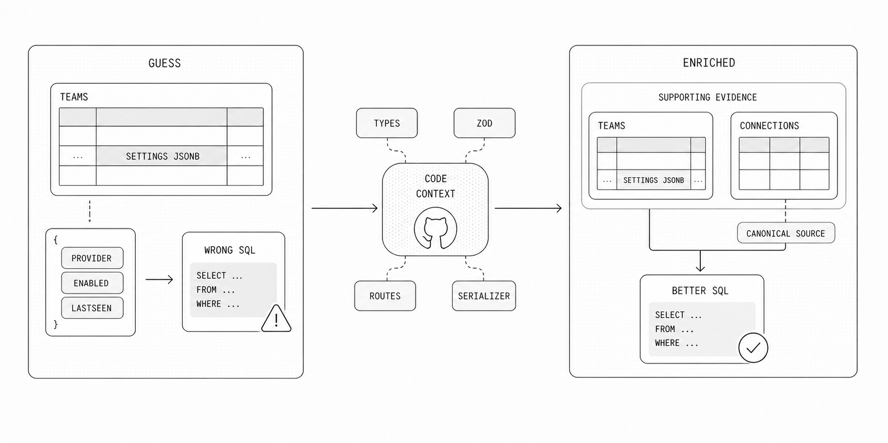
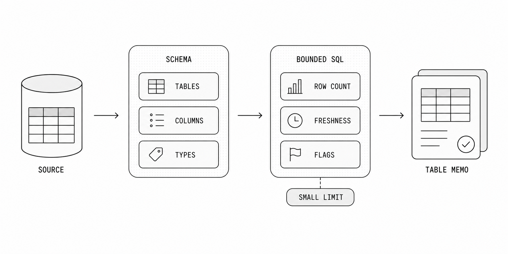
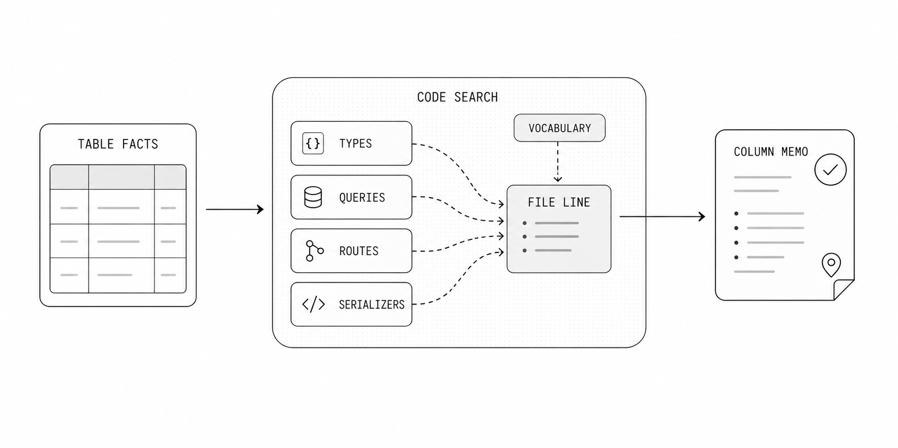
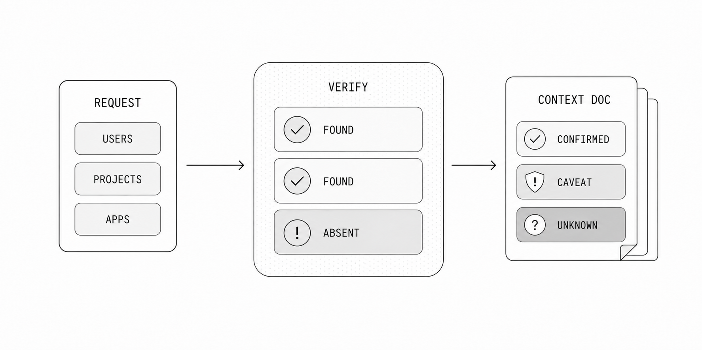

## From Context Enrichment to Implementation

OpenAI's writeup on its in-house data agent describes context enrichment as a layer that derives code-level definitions of tables, captures usage context from systems beyond SQL, and helps an agent distinguish between tables that look similar but differ in critical ways: https://openai.com/index/inside-our-in-house-data-agent/

This post covers how to implement that Context Enrichment idea with OneQuery. The goal is to turn raw source metadata into operational memory an agent can actually use: which tables exist, what columns mean, how freshness and soft deletes work, where application code proves those assumptions, and which claims should stay uncertain.

The example implementation repo is available here: https://github.com/wordbricks/onequery-context-enrichment

OneQuery is a good boundary for this workflow because the agent can inspect real data through scoped, audited, read-only access without receiving database credentials or bypassing source permissions.

## Why Context Enrichment Matters

Context enrichment matters because table and column names are often plausible but incomplete. JSONB columns make this especially obvious. A column named metadata, properties, payload, settings, or attributes may contain dozens of nested fields whose meaning depends on application code, event producers, serializers, feature flags, and migration history.

For example, suppose an analyst asks which integrations are most often configured by active teams and the agent finds a teams table with a jsonb column named settings. A bounded sample might show keys like integrations, sync, enabled, provider, and lastSeenAt. From the column name and raw values alone, the agent may assume settings->'integrations' is the current source of truth, count every provider with enabled = true, and group by lastSeenAt as if it were the last successful sync time.

That analysis can be confidently wrong. The codebase might reveal that settings->'integrations' is a legacy UI cache, that the real enabled state is derived from connection records, that lastSeenAt is only updated when the settings panel is opened, and that provider names are normalized by a serializer before they appear in product analytics. In that case, the JSON shape is real, but the analysis based on it answers the wrong operational question.

Code base context enrichment changes the result. By searching type definitions, zod schemas, serializers, route handlers, analytics producers, and query builders, the runner can discover which JSONB keys are persisted inputs, which are denormalized cache, which are deprecated, and which require a join to a canonical table. With that context, the agent can count active integrations from the connection lifecycle table, use settings only as supporting evidence, normalize provider names the same way the product does, and explain why the JSONB column should not be treated as authoritative on its own.

## What Context Enrichment Produces

The output of context enrichment should be more specific than a schema dump. A useful run produces table memos, column memos, code evidence, and context documents that can be reviewed, indexed, or handed to downstream agents.

A table memo describes the role of a table, important lifecycle rules, confidence, row counts, freshness, and caveats. A column memo explains business meaning, joins, nullability behavior, redaction expectations, and the evidence behind the explanation.

The key requirement is provenance. Every high-confidence claim should be traceable to a schema query, a bounded data sample, or a code reference. Claims without evidence should stay low confidence or remain explicitly unknown.

| Artifact | Purpose |
| --- | --- |
| tables.json | Normalized table and column inventory from the selected OneQuery source. |
| table_memos.json | Human-readable table descriptions, lifecycle notes, confidence, caveats, and evidence links. |
| column_memos.json | Column-level semantics, joins, privacy notes, usage patterns, and uncertainty. |
| code_evidence.jsonl | File and line references showing how application code reads or names the database objects. |
| context_documents.jsonl | Chunked documents suitable for retrieval, review, or agent context injection. |

## Use OneQuery as the Boundary

The first design choice is to put OneQuery between the agent and the database. The agent should resolve its organization, source, and permissions through OneQuery, then use OneQuery execution for every database read.

A practical run starts by checking the active identity with onequery auth whoami, resolving the organization and source, and recording those identifiers in the run metadata. From there, all SQL goes through the selected OneQuery source.

This keeps credentials out of the agent runtime. It also gives operators a single place to enforce read-only validation, single-statement execution, row limits, timeouts, source permissions, and audit trails.

## Collect Database Evidence First

Start with the database, not the application code. Query information_schema for the requested tables, columns, data types, nullability, defaults, and primary key hints. If the table is missing, record that as a finding instead of inventing a nearby table.

Then run small, bounded aggregate queries for facts that help agents reason correctly: approximate row counts, soft-delete counts, freshness timestamps, status distributions, visibility flags, and nullable foreign keys. The point is not to dump rows. The point is to gather enough facts to describe behavior.

Every query should be narrow and reviewable. In the demo runner, ad hoc exploration used small limits, aggregate-only probes where possible, and explicit validation before execution. That makes the enrichment repeatable and easier to audit.

## Add Code Evidence

Schema facts explain what exists. Code evidence explains how the product treats it. After resolving the relevant GitHub source through OneQuery, the enrichment run can search the repository for table names, generated types, query builders, routes, serializers, and domain-specific aliases.

The runner should store concrete file paths and line numbers, not vague summaries. A memo that says a column is a public identifier is much stronger when it links to the route or projection that uses that column as the public lookup key.

Code evidence is also where enrichment catches product vocabulary. In the demo, application behavior for public apps was represented through project projections and types, even though the requested public.apps table did not exist in the selected database source.

## Preserve Uncertainty

The most important rule is to preserve uncertainty. If a table is absent from the selected source, the output should say that directly. If a column appears sensitive but the code does not prove redaction behavior, the memo should flag the risk instead of claiming safety.

This matters because context enrichment becomes a dependency for later agents. A confident but false memo can steer future SQL, product analysis, or support answers in the wrong direction. A precise caveat is more useful than an invented explanation.

A good output can still be helpful when something is missing. For example, it can record the absent table, list the evidence checked, and point to the closest verified table or code path as an alternative.

## Demo Run Shape

The context-enrichment demo used OneQuery to enrich three requested objects in the public schema: users, projects, and apps. The run resolved the organization and source, inspected schema metadata, ran bounded evidence queries, searched the linked codebase, and emitted JSON artifacts. The repository for the demo runner is here: https://github.com/wordbricks/onequery-context-enrichment

The result found public.users and public.projects in the selected source and generated memos for their table and column behavior. It also reported that public.apps was absent from information_schema for that source, then connected the application-level app behavior to verified public.projects usage instead.

That result is the workflow working as intended. The agent did not need raw database credentials, did not assume a missing table existed, and still produced reviewable context that connects database facts to product code.

## Make It Repeatable

For production use, treat enrichment as a run with state rather than a one-off chat. Create a run directory, persist request metadata, append events, write intermediate artifacts, validate final JSON, and make repair steps explicit.

That shape gives teams a review surface. They can diff table memos across schema changes, inspect the exact queries and code references behind a claim, and decide which context documents should be published to a retrieval system.

OneQuery supplies the controlled data path. The enrichment runner supplies the repeatable artifact pipeline. Together they give agents enough context to reason about real systems without turning the agent runtime into a credential vault.
