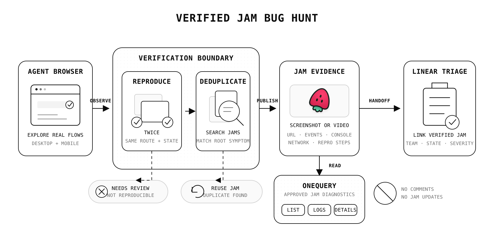

## A bug hunt is an evidence pipeline

Browser agents can cover a surprising amount of product surface. They can move through onboarding, CRUD flows, search, sharing, settings, empty states, responsive layouts, keyboard navigation, console errors, and failed network requests without waiting for a manual test script.

The hard part is not finding something that looks wrong. The hard part is proving that it is a real, reproducible bug and leaving enough evidence for the next person or agent to act on it.

That is where [Jam](https://jam.dev/) fits. A Jam can keep the page URL, screenshot or video, console output, network activity, user events, and reproduction context together. Instead of handing engineering a sentence like "the form sometimes breaks," the hunting agent can hand off one inspectable record of what happened.

The workflow we use follows one rule: publish fewer findings, but make every published finding reproducible.



## The loop

The complete loop is:

```text
Explore
-> observe
-> reproduce twice
-> check for an existing Jam
-> capture evidence
-> publish and verify the Jam
-> hand off to the correct triage queue
-> verify the handoff
```

Each step removes a different source of noise. Exploration finds candidate problems. Reproduction filters out transient glitches. Duplicate checks keep the evidence system usable. Jam preserves the browser state. Verification catches failed or malformed publications. The tracker handoff gives the issue an owner without losing the original diagnostics.

## Start as a black-box tester

The hunting agent should behave like a user, not like a developer reading the implementation. It maps visible navigation, exercises realistic goals, and judges only observable behavior.

A useful default scope includes:

- Authentication entry and session expiry, with authentication completed before recording.
- Primary creation and editing flows using disposable test data.
- Onboarding, search, sharing, settings, and empty or error states.
- Desktop first, then a mobile viewport such as `390x844`.
- Keyboard focus, labels, contrast, clipped content, loading feedback, unclear errors, broken controls, console errors, and failed requests.

At each meaningful state, the agent takes a fresh browser snapshot and inspects browser errors, console output, and network requests. Fresh snapshots matter because references to interactive elements can become stale after navigation or dynamic UI changes.

Local or staging environments are the safest default. Production exploration should stay read-only unless someone has explicitly authorized state-changing actions. Dedicated test accounts and seeded data also keep customer information out of screenshots and recordings.

## Reproduce before recording

An observation becomes a candidate bug only after the agent can return to a known state and reproduce it at least twice.

For each candidate, record:

| Evidence                     | Why it matters                                                  |
| ---------------------------- | --------------------------------------------------------------- |
| Exact URL                    | Identifies the affected route and state.                        |
| Viewport                     | Separates responsive defects from general defects.              |
| Account role                 | Makes permission and role-specific behavior visible.            |
| Expected behavior            | Defines the product contract being violated.                    |
| Actual behavior              | Describes the observable failure without guessing at the cause. |
| Minimal steps                | Gives another tester the shortest path back to the failure.     |
| Console and network evidence | Connects the visible symptom to browser diagnostics.            |

Subjective preferences are not automatically bugs. A UX finding should point to observable friction: a blocked goal, misleading label, missing feedback, inaccessible interaction, inconsistent control, or violated interface pattern.

Before creating anything, search existing Jams for the same route and symptom. If the same root issue already exists, record a sanitized recurrence instead of creating another report. If the environment or reproduction is materially different, create a new Jam and cross-link it.

## Match the capture to the failure

Static UI, content, and accessibility bugs usually need a clean screenshot for Jam plus an annotated copy for the local report. Timing, state, and interaction bugs need a short video that starts from a clean precondition and stops when the failure is visible.

The capture should show the bug, not the tester getting ready to show the bug. Authenticate before recording. Move at a human-readable pace. Avoid unrelated tabs and notifications. Never upload credentials, cookies, customer PII, payment data, private prompts, or tokens.

Create the Jam while the reproduction state is still available, then add the structured details as a comment:

```text
Title: [Agent QA][app][severity][category] observable symptom
URL and viewport
Account role and environment
Expected behavior
Actual behavior
Minimal reproduction
Sanitized console and network observations
Local evidence paths
```

Finally, read the Jam back and verify its ID, URL, title, and evidence. If publishing fails, keep the local artifacts. A failed upload should not erase the work that proved the bug.

## Keep Jam diagnostics bounded with OneQuery

Publishing and reading are separate responsibilities in this workflow.

The hunting agent uses Jam's own CLI to create the evidence record. A Jam source connected to OneQuery gives later agents a controlled, read-only path to inspect that record through Jam's official MCP endpoint. OneQuery stores the workspace connection and exposes only an approved set of diagnostic operations:

| Operation                               | What an agent can learn                                        |
| --------------------------------------- | -------------------------------------------------------------- |
| `listJams`                              | Find existing reports and check for likely duplicates.         |
| `getDetails` and `getMetadata`          | Read the report context and capture metadata.                  |
| `getConsoleLogs`                        | Inspect browser errors and relevant console output.            |
| `getNetworkRequests`                    | Review failed or suspicious requests around the reproduction.  |
| `getUserEvents`                         | Reconstruct the recorded interaction sequence.                 |
| `getVideoTranscript` and `analyzeVideo` | Understand longer reproductions without scrubbing manually.    |
| `listFolders` and `listMembers`         | Resolve visible workspace organization and membership context. |

Comment creation, Jam updates, and screenshot binary retrieval are not exposed through the OneQuery Jam adapter. That boundary is deliberate: an analysis or triage agent can inspect the evidence it needs without silently editing the source report.

This also keeps the Jam token out of the agent prompt and runtime. The agent calls a named OneQuery source, OneQuery applies the source permissions and approved operation list, and the result remains attributable to that access path.

## Hand verified evidence to triage

A Jam is the reproduction record. A tracker issue is the unit of planning and ownership. The handoff should link the two instead of copying fragments of browser evidence into an untraceable summary.

For a Linear handoff, the agent should:

1. Resolve the product's exact owning team from verified workspace information.
2. Require that team's real `Triage` state instead of guessing at a similar queue.
3. Search for an issue carrying the Jam's stable identity marker.
4. Reuse one verified match, block on multiple matches, and create only when none exist.
5. Include the clickable Jam URL, route, viewport, severity, expected behavior, actual behavior, and minimal reproduction.
6. Read the issue back and verify the team, state, title, Jam URL, and identity marker.

The duplicate checks happen on both sides. Jam deduplication keeps evidence coherent. Tracker deduplication prevents two planning records from competing for the same verified report.

## Failure should preserve evidence

Automation becomes trustworthy when partial failure has an explicit state.

| Failure                                 | Safe behavior                                                          |
| --------------------------------------- | ---------------------------------------------------------------------- |
| The observation cannot be reproduced    | Keep it local as `needs_review`; do not publish.                       |
| Jam publishing fails                    | Preserve screenshots, videos, notes, and the exact error.              |
| Jam succeeds but tracker creation fails | Keep the verified Jam and mark the handoff as blocked.                 |
| Team ownership is ambiguous             | Create no tracker issue until ownership is resolved.                   |
| A tracker response is ambiguous         | Read back the result; never create a second issue as a repair attempt. |
| Sensitive data cannot be excluded       | Keep evidence local and report the upload blocker.                     |

This is more useful than an all-or-nothing script. A verified Jam still has value when the tracker is unavailable. Local evidence still has value when publication is blocked. Nothing needs to be invented or duplicated to make the run look successful.

## A practical request for an agent

A good bug-hunt request defines the target, environment, scope, and stopping condition:

```text
Dogfood the staging web app as a black-box user.
Cover the primary creation flow, settings, and one mobile viewport.
Reproduce every candidate issue twice.
Publish one Jam per verified issue and avoid duplicates.
Use OneQuery for read-only Jam diagnostics and the approved Linear handoff.
Stop after five verified issues or when the core scope is exhausted.
Do not fix code during the hunt.
```

Separating hunting from fixing is important. The hunt optimizes for broad exploration and high-confidence evidence. A later engineering agent can take one verified issue, inspect the relevant implementation, make a narrow change, and use the Jam reproduction as its acceptance test.

## What this changes

Jam makes browser evidence portable. OneQuery makes that evidence available to agents through a bounded read path. A verified tracker handoff makes the result operational.

Together, they turn autonomous QA from a stream of screenshots into a repeatable system: explore like a user, prove the failure, preserve the browser context, expose diagnostics without exposing raw credentials, and hand one verified issue to the team that can act on it.
