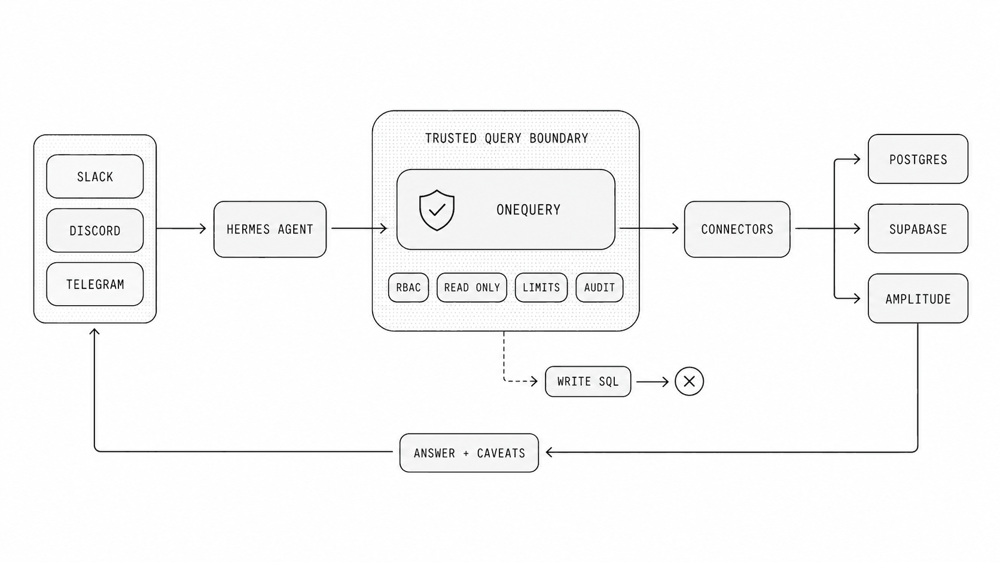

## Internal data agents need a boundary

[Hermes Agent](https://hermes-agent.nousresearch.com/) is compelling because it can live where people already ask for help: Slack, Discord, Telegram, CLI, and other personal or team surfaces. That makes it a natural place to ask internal data questions.

It also changes the risk model. When an agent can answer questions from a messaging channel, the data path is no longer just a developer at a terminal. It is a model, a chat interface, a skill system, source credentials, query execution, and whatever team permissions sit around that channel.

[Jaeyoun Nam's DEV walkthrough](https://dev.to/siisee11/analysis-internal-data-safely-with-hermes-agent-and-onequery-18fg) shows the useful version of this pattern: connect OneQuery, install the OneQuery skill in Hermes, then ask Hermes to analyze internal data from Slack. The important product lesson is not only that the workflow works. The important lesson is that a personal agent needs a real data boundary before it becomes a shared company tool.

## What can go wrong with direct access

A direct database tool feels simple at first. Give Hermes a connection string, add a prompt that says "only run safe queries," and let the model do the rest.

That shortcut creates several failure modes:

| Risk             | What happens without a boundary                                                                                 |
| ---------------- | --------------------------------------------------------------------------------------------------------------- |
| Secrets exposure | Raw database passwords, SaaS tokens, or API keys can leak into prompts, logs, screenshots, or chat transcripts. |
| Write access     | A model can generate an update, delete, migration, or API mutation if the credential allows it.                 |
| Query cost       | Warehouse and analytics queries can scan too much data or retry in loops.                                       |
| Production load  | A broad query can hurt a production database even when it is read-only.                                         |
| Shared channels  | A teammate, compromised account, or copied prompt can ask the agent for data they should not see.               |
| No audit trail   | The team cannot easily answer who asked, which source ran, what SQL executed, and what data returned.           |

Prompt rules are still useful. They help the agent behave well in normal cases. They are not a security boundary because they do not change what the credential can do.

## Where OneQuery fits

OneQuery gives Hermes a narrower way to reach company data. Hermes does not need raw provider credentials in its runtime. It calls a OneQuery skill or CLI command against a named source, and OneQuery resolves the source configuration, applies the configured controls, executes the bounded operation, and returns a result the agent can explain.

That split matters:

| Hermes Agent should handle        | OneQuery should handle              |
| --------------------------------- | ----------------------------------- |
| Understanding the user's question | Source configuration                |
| Choosing an analytical path       | Credential ownership                |
| Drafting SQL or API requests      | Read-only execution boundaries      |
| Explaining results and caveats    | Role and source permissions         |
| Asking follow-up questions        | Timeouts, limits, and audit records |

The model stays useful because it can reason over the question and the result. The dangerous authority moves into a deterministic data layer that can be configured, reviewed, and operated by the team.



## A practical setup

Install OneQuery and authenticate the CLI:

```sh
curl -fsSL https://onequery.dev/install.sh | sh
onequery auth login
onequery source list
```

Install Hermes Agent from the current Hermes installer:

```sh
curl -fsSL https://hermes-agent.nousresearch.com/install.sh | bash
hermes setup
```

Then install the standalone OneQuery skill for Hermes:

```sh
hermes skills install skills-sh/wordbricks/skills/onequery-cli --yes --force
```

Start Hermes with the skill preloaded:

```sh
hermes chat --skills onequery-cli
```

For a channel-based workflow, connect Hermes to the team surface you want to use, such as Slack or Discord. In OneQuery, connect the sources Hermes is allowed to use, such as a read-only Postgres replica, Supabase project, warehouse, Amplitude workspace, or product analytics source.

The key is to expose named sources, not provider credentials. A Hermes instruction should look like this:

```text
Use OneQuery for internal data analysis.
Do not ask for raw database credentials, SaaS tokens, or cloud keys.
Allowed sources:
- postgres://warehouse_prod
- amplitude://product_main
Use aggregate queries first, explicit time windows, and small limits.
Return the source, query shape, assumptions, and caveats with the answer.
```

## The safe request loop

A healthy Hermes plus OneQuery loop is small and inspectable:

1. A user asks a question in Slack, Discord, Telegram, or the Hermes CLI.
2. Hermes identifies the likely source and drafts a bounded query or API request.
3. OneQuery checks the named source, credential, permission, and execution boundary.
4. The source returns a small, task-specific result.
5. Hermes summarizes the result with assumptions, caveats, and the source path.
6. Operators can review the request later through the OneQuery audit trail.

This loop makes denials normal. If a user asks for a source they cannot use, Hermes should say that the source is not available. If a query is too broad, Hermes should narrow the time window or ask for approval. If the question needs raw exports, Hermes should explain why that is outside the default workflow.

## Guardrails worth making explicit

The most important guardrail is read-only access. For SQL sources, use credentials that cannot mutate data. For provider APIs, expose endpoints and scopes that match the analytical job. Do not depend on the model to remember which operations are dangerous.

The second guardrail is source-level permission. A founder may be able to inspect billing and product analytics. A support teammate may need account health data but not payroll, security events, or raw user emails. If Hermes is used in team channels, the OneQuery source list should match the role and the channel.

The third guardrail is cost. Agents are good at retries. That is useful when a query has a syntax error, but risky when a warehouse query scans too much data. Use explicit time windows, row limits, aggregate-first queries, and provider-side budgets where available.

The fourth guardrail is auditability. A useful answer should not be a mystery. The team should be able to review which source was used, what query or provider operation ran, who requested it, when it happened, and what result shape came back.

## A good first use case

Start with one narrow workflow:

```text
Report daily active users and seven-day retention for the onboarding flow
over the last 30 days. Use amplitude://product_main. Prefer aggregate
queries and include caveats about incomplete events or attribution gaps.
```

That question is useful, bounded, and easy to review. It does not require raw event exports. It has a clear time window. It can return a compact table and a short explanation.

Once that works, add one source at a time. Product analytics first. Then a read-only warehouse. Then support or billing data if the team has a permission model for it. Resist the urge to connect every internal API on day one.

## What this unlocks

Hermes gives teams a fast, conversational surface for asking internal questions. OneQuery gives that surface the data boundary it needs to be useful in production-like environments.

Together, they let a team ask real questions without turning every chat message into a raw credential decision. Hermes can plan, query, summarize, and follow up. OneQuery can keep credentials out of the agent runtime, enforce bounded execution, and preserve the record of what happened.

That is the difference between a neat demo and an internal data agent a team can actually operate.
