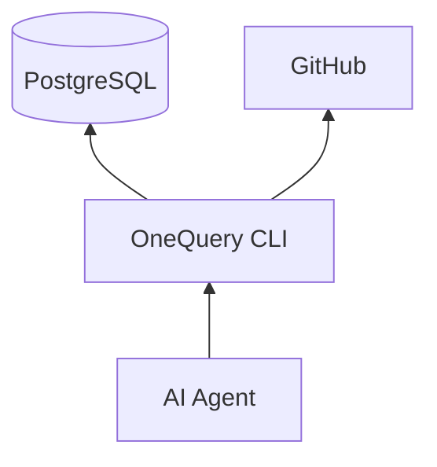
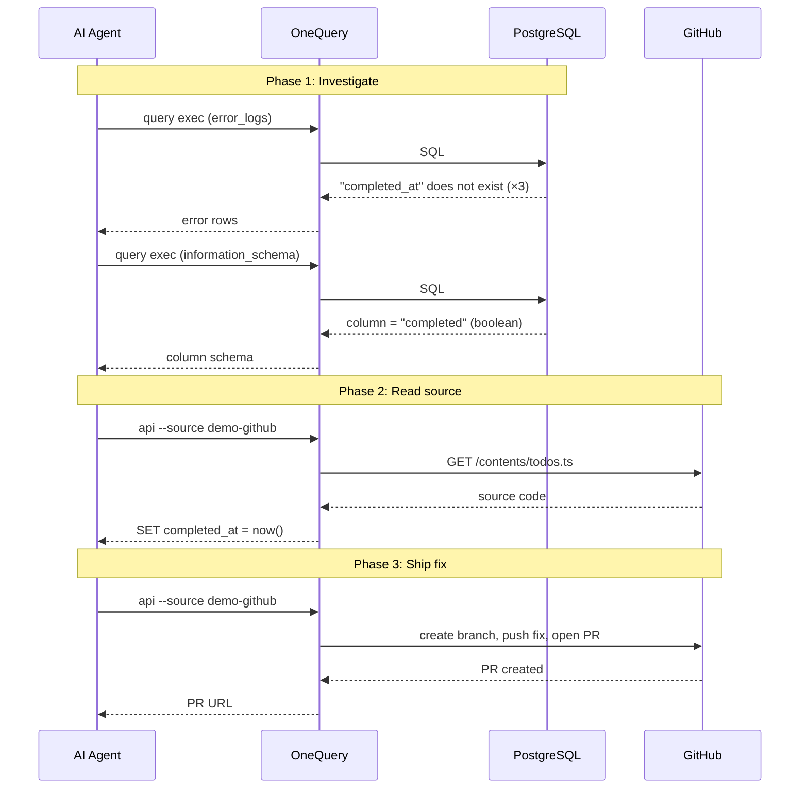

# Auto-Debug Demo

**An AI agent diagnoses a production bug and ships a fix, all through a
single CLI.**

A minimal TODO app has a bug. Every `PATCH` request returns a 500, and errors
pile up in PostgreSQL. An AI agent uses `onequery` to query the database, read
source code from GitHub, and open a pull request. No tool switching, no
credential juggling.



The agent doesn't talk to PostgreSQL or GitHub directly. It talks to OneQuery.
OneQuery talks to everything else.

---

## The Walkthrough

The TODO app's "mark as completed" endpoint is broken. Every
`PATCH /todos/:id` returns a 500. The errors are logged to an `error_logs`
table in the same database.

OneQuery connects to data sources by name. In this demo, `demo-app-db` is a
PostgreSQL database and `demo-github` is a GitHub account, both registered
with `onequery source connect` during setup.



### Phase 1: Find the errors in the database

```bash
onequery query exec --source demo-app-db --json \
  --sql "SELECT error_type, message, COUNT(*) AS occurrences
         FROM error_logs
         GROUP BY error_type, message
         ORDER BY occurrences DESC"
```

```json
{
  "rows": [
    {
      "error_type": "PostgresError",
      "message": "column \"completed_at\" of relation \"todos\" does not exist",
      "occurrences": 3
    }
  ]
}
```

Three errors, same message. The code references a column called `completed_at`
but does that column exist?

```bash
onequery query exec --source demo-app-db --json \
  --sql "SELECT column_name, data_type
         FROM information_schema.columns
         WHERE table_name = 'todos'
         ORDER BY ordinal_position"
```

```json
{
  "rows": [
    { "column_name": "id",         "data_type": "integer" },
    { "column_name": "title",      "data_type": "text" },
    { "column_name": "completed",  "data_type": "boolean" },
    { "column_name": "created_at", "data_type": "timestamp with time zone" }
  ]
}
```

There's no `completed_at`. The column is `completed`, a boolean.

### Phase 2: Read the source code from GitHub

Same CLI, different source:

```bash
onequery api --source demo-github \
  "/repos/$GITHUB_REPO/contents/src/routes/todos.ts" --json
```

The agent finds the bug in the `PATCH` handler:

```sql
UPDATE todos SET completed_at = now() WHERE id = $1
```

The code uses `completed_at` (a timestamp), but the column is `completed`
(a boolean). A developer renamed the column and forgot to update this query.

### Phase 3: Ship the fix through GitHub

Still `onequery`, now writing to GitHub instead of reading from PostgreSQL:

```bash
# Get the base branch SHA
onequery api --source demo-github \
  "/repos/$GITHUB_REPO/git/ref/heads/main" -q ".object.sha"

# Create a fix branch
onequery api --source demo-github -X POST \
  "/repos/$GITHUB_REPO/git/refs" \
  --input '{"ref":"refs/heads/fix/completed-column","sha":"abc123..."}'

# Push the corrected file (base64-encoded)
onequery api --source demo-github -X PUT \
  "/repos/$GITHUB_REPO/contents/src/routes/todos.ts" \
  --input '{"message":"fix: use completed column","branch":"fix/completed-column",...}'

# Open a pull request with error log evidence in the body
onequery api --source demo-github -X POST \
  "/repos/$GITHUB_REPO/pulls" \
  --input '{"title":"fix: use completed column instead of completed_at",...}'
```

The fix is one line:

```diff
- UPDATE todos SET completed_at = now() WHERE id = $1
+ UPDATE todos SET completed = true WHERE id = $1
```

Every step (querying error logs, checking column names, reading source code,
creating a branch, pushing a fix, opening a PR) went through `onequery`.

---

## Try It Yourself

### Prerequisites

- [OneQuery CLI](https://github.com/wordbricks/onequery) installed
- [Docker](https://docs.docker.com/get-docker/) for the demo PostgreSQL
- [Bun](https://bun.sh/) for the demo app
- A GitHub Personal Access Token with `repo` scope
- No local PostgreSQL client is required; `setup.sh` runs `psql` inside the `demo-db` container.

> **Warning:** Never commit your `GITHUB_TOKEN`. Use environment variables.

### Quick Start

```bash
# 1. Set environment variables
export GITHUB_TOKEN="ghp_your_token_here"
export GITHUB_REPO="your-org/todo-app"

# 2. Set up the environment (DB, schema, seed data, app, OneQuery sources)
./setup.sh
```

Then paste `agent-prompt.md` into Claude Code or OpenClaw for an autonomous run:

```bash
# Claude Code with OneQuery plugin
claude plugins install @onequery/openclaw-plugin
claude plugins enable onequery

# OpenClaw with OneQuery plugin
openclaw plugins install @onequery/openclaw-plugin
openclaw plugins enable onequery
```

### Cleanup

```bash
docker compose -f docker-compose.yml down -v
```
